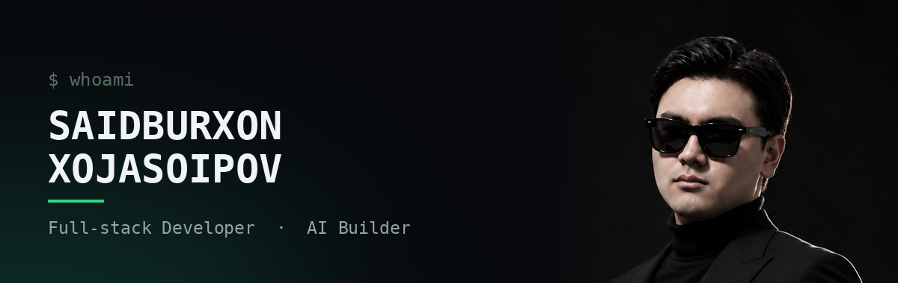
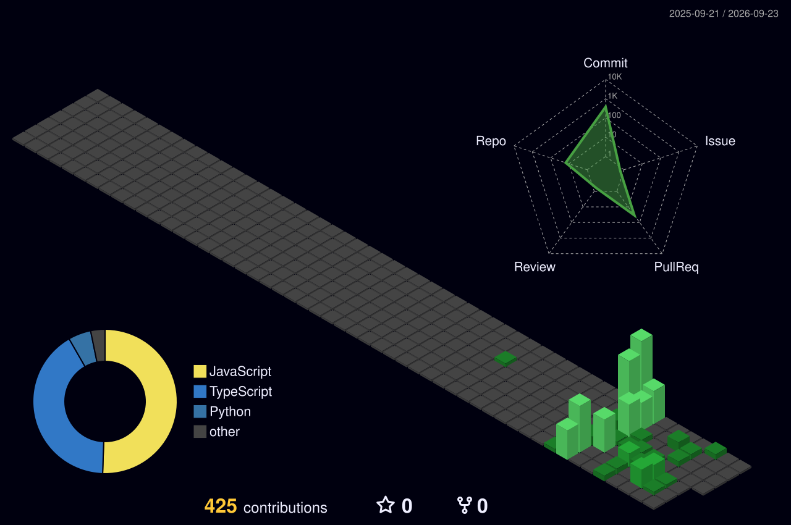

<div align="center">
  
</div>

<div align="center">


<br/>

<a href="https://xojasoipov-sketch.github.io/Portfolio/"></a>
<a href="https://t.me/xojasoipov"></a>
<a href="mailto:xojasoipov@gmail.com"></a>
<a href="https://github.com/xojasoipov-sketch"></a>

<br/>


</div>

---

## <samp>~/ whoami</samp>


```console
$ cat about.txt
```

Hi, I'm **Saidburxon Xojasoipov** — a full-stack developer and AI builder from
Tashkent, Uzbekistan. I build digital products where the web, automation and
AI meet: SaaS platforms, CRM systems, Telegram bots and AI-integrated services.

- 🛠 **Currently building** — ZET (AI operating system) and SADIPRIME (AI SaaS for education)
- 🌐 **Portfolio** — [xojasoipov-sketch.github.io/Portfolio](https://xojasoipov-sketch.github.io/Portfolio/)
- 🧠 **Focus** — AI agents, LLM APIs, multi-tenant SaaS, workflow automation
- ⚙️ **How I work** — deep audit first, precise solution after; first working result in 3–7 days
- 💬 **Ask me about** — React/Next.js, FastAPI, PostgreSQL, Telegram Bot API, LLM integrations

<br clear="right" />

---

## <samp>~/ toolbox</samp>

<div align="center">

**Languages**


**Frontend**


**Backend & Data**


**Infra & Tools**


</div>

---

## <samp>~/ projects</samp>

| Project | What it is | Stack |
| :--- | :--- | :--- |
| **ZET** | AI operating system — one interface orchestrating multiple AI providers | Next.js · Python · LLM APIs |
| **SADIPRIME** | Multi-tenant AI SaaS for education & business management | React · FastAPI · PostgreSQL |
| **PARI AI** | AI assistant delivered through Telegram | Python · Telegram API · LLM |
| **DLI SHOP** | E-commerce platform with admin dashboard | React · Node.js · MongoDB |
| **BUSINESS HUB** | Business management bot with an admin panel | Python · Telegram API |

<div align="center">
  <a href="https://xojasoipov-sketch.github.io/Portfolio/">→ See full case studies on my portfolio</a>
</div>

---

## <samp>~/ statistics</samp>

<div align="center">


<br/>


</div>

---

## <samp>~/ activity</samp>

<div align="center">


<br/>



</div>

---

<div align="center">


</div>

---

<div align="center">

### <samp>~/ let's build something</samp>

Open to freelance projects, product collaborations and long-term partnerships.

<a href="https://t.me/xojasoipov"></a>
<a href="mailto:xojasoipov@gmail.com"></a>

<br/><br/>

<sub><i>"Deep audit first, precise solution after."</i></sub>

</div>
